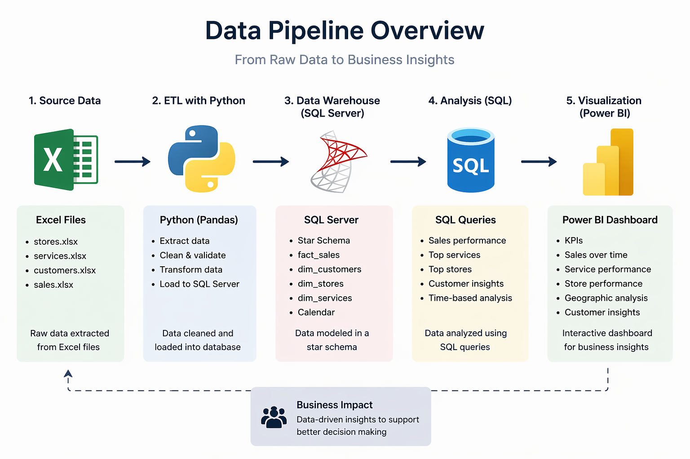
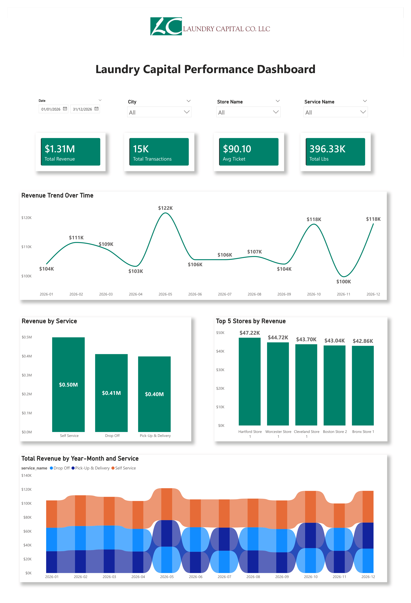
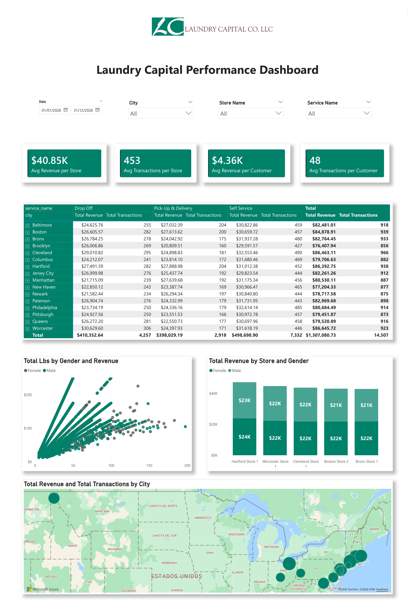

# 📊 Laundry Capital Multi-Location Operations Reporting Suite

An end-to-end reporting and dashboarding project designed to simulate the operational reporting environment of a multi-location retail laundromat business.

This solution was built to monitor store performance, customer activity, service utilization, and recurring revenue trends across multiple U.S. locations using Excel, Python, SQL Server, and Power BI.

## 🏢 Business Context

Laundry Capital operates a large network of retail laundromat locations across several U.S. states, offering self-service laundry, drop-off wash & fold, and pick-up & delivery services.

As a multi-location retail operator, business stakeholders require recurring visibility into:

- Store-level revenue and transaction performance
- Service line contribution
- Customer usage patterns
- Underperforming locations
- Month-over-month operational trends

This repository simulates a practical reporting suite built to support those recurring business decisions.

## 🔄 Data Pipeline
Excel → Python (ETL) → SQL Server → Power BI

## 📊 Data Model
Star schema with fact_sales and dimension tables

## 🧠 Key Insights
- Most profitable service
- Top performing stores
- Revenue trends

## 🛠️ Tools Used
Python, SQL Server, Power BI

## 🔄 Data Pipeline

## 📈 Dashboard

## 💡 Key Insights

- Self Service is the top-performing service, generating approximately $0.50M in revenue, outperforming both Drop-Off and Pick-Up & Delivery services.

- Revenue remains relatively stable throughout 2026, fluctuating between ~$100K and ~$122K monthly, with noticeable peaks around May and October.

- Store performance is fairly concentrated, with the top 5 stores (e.g., Hartford, Worcester, Cleveland) each generating over $42K, indicating consistent high performers across locations.

- Average revenue per store is ~$40.85K and per customer ~$4.36K, showing a balanced distribution of revenue across both locations and customer base.

- Customer activity is strong, with an average of 48 transactions per customer, suggesting a mix of recurring and loyal customers.

- Geographic distribution shows revenue spread across multiple cities, with no single city overwhelmingly dominating, indicating a diversified market presence. 

- Given the strong performance of Self Service, expanding capacity or optimizing pricing for this service could further increase overall revenue.